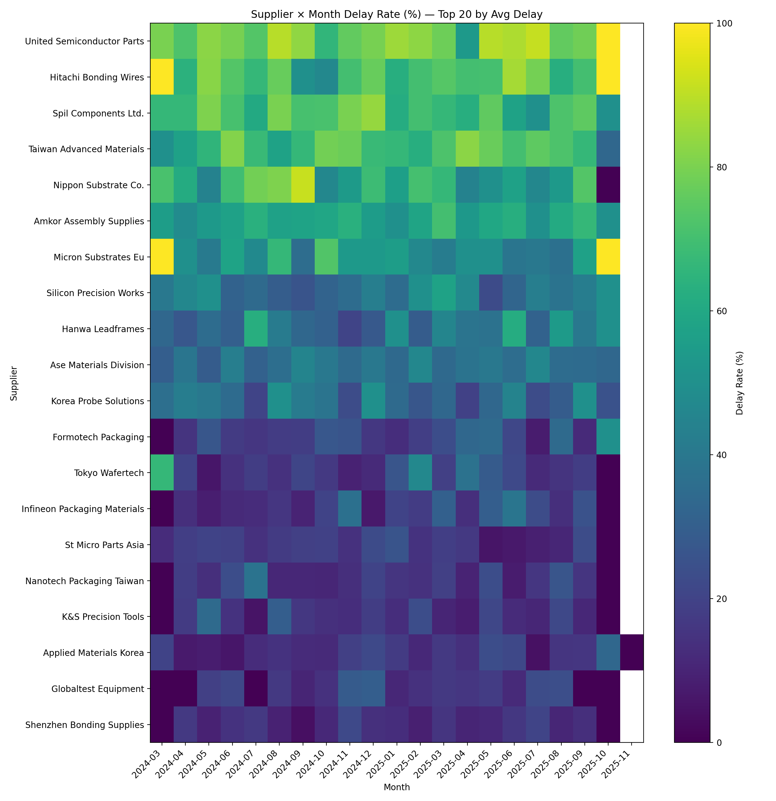
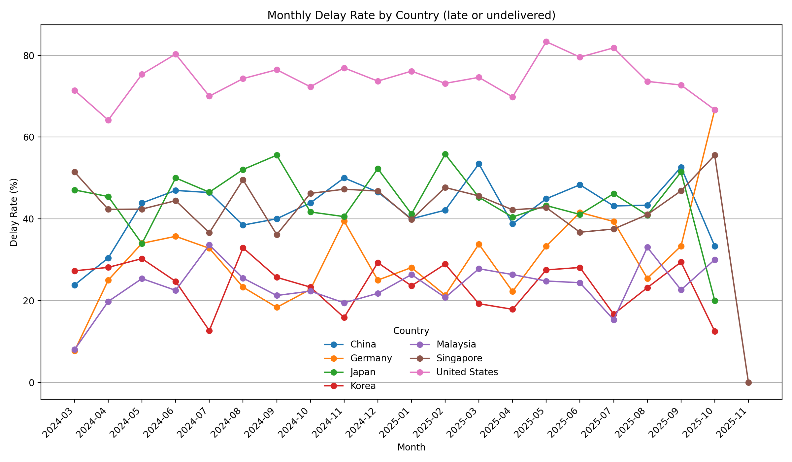

# Semiconductor Supply Chain & Inventory Risk Analytics

## Project Overview

This project analyzes semiconductor supply chain performance and inventory risk using simulated industry data. The analysis covers supplier performance, delivery delays, demand forecasting, and root cause analysis, producing actionable insights for improving on-time delivery, reducing risk, and optimizing operations.

The dataset and workflows simulate challenges faced by companies in IC foundry, packaging, and testing sectors such as SPIL, UMC, Realtek, ASML Taiwan, ASE, USI, Ardentec, and OSE.

## Objectives

* Monitor and evaluate supplier performance across key KPIs.
* Identify late delivery patterns and root causes.
* Forecast demand and assess risk for upcoming months.
* Provide visual dashboards and scorecards for decision-making.

## Key Findings

* **Top Delay Contributors:** Certain suppliers showed consistently higher average delays, primarily from overseas logistics constraints.
* **Geographic Delay Patterns:** Higher late delivery rates observed in specific regions, indicating possible port or customs delays.
* **Category-Level Risk:** Critical components in high-demand categories showed the greatest stock-out risk.
* **Forecast Accuracy:** Demand forecasting achieved high accuracy for stable categories, with volatility in niche components.

## Tools & Technologies

* **Languages:** Python, SQL
* **Visualization:** Tableau, Power BI, Matplotlib, Seaborn
* **Data Handling:** Pandas, NumPy, Excel
* **Forecasting:** Statsmodels (STL decomposition), Time series analysis

## Folder Structure

```
clean_data/               # Cleaned and processed datasets used for analysis
    figures/              # Visualizations generated from analysis
    ...csv                # KPI tables, RCA outputs, risk scores
raw_data/                 # Original datasets (untouched)
notebooks/                # Jupyter notebooks for each analysis stage
outputs/                  # Final scorecards, charts, and deliverables
sql/                      # SQL scripts for EDA and data extraction
```

## Workflow

1. **Data Cleaning:** `data_cleaning.ipynb` processes raw data into cleaned datasets.
2. **EDA & KPI Calculation:** `EDA_Report_Semicon_Supply_Chain.ipynb` generates performance metrics.
3. **Forecasting & Risk:** `demand_vs_supplyForecasting.ipynb` produces demand forecasts and risk indexes.
4. **Visualization:** `visualization.ipynb` creates supplier scorecards, heatmaps, and dashboards.

## How to Reproduce

1. Clone the repository.
2. Install dependencies:

```bash
pip install -r requirements.txt
```

3. Run notebooks in the following order:

   1. `data_cleaning.ipynb`
   2. `eda_queries.sql`
   3. `forecasting_and_risk.ipynb`
   4. `supplier_kpis.ipynb`
   5. `visualization.ipynb`

## Example Visuals




## Deliverables (In Process)

* **Supplier Scorecard**: Excel file summarizing supplier performance across KPIs.
* **Visual Dashboard**: Charts for delay heatmaps, lead time trends, and demand risk.
* **Full Report**: PDF with detailed findings and recommendations (in `/docs/`).

## Impact

This project demonstrates practical analytics capabilities for semiconductor operations:

* Improves supplier performance monitoring.
* Enables early risk detection for inventory shortages.
* Supports data-driven decision-making for procurement and logistics.

---

**Author:** Devin Richmond

**Role:** Data Analyst / Semiconductor Operations Analytics
